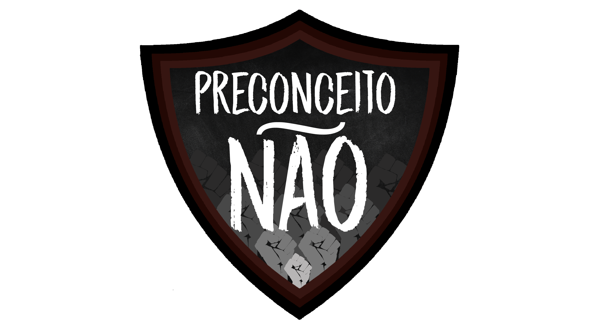

# Ética e Cidadania Organizacional
 - Preconceito

>**Trata-se de um site informativo**,tal ideia foi formada a partir do tema Diversidade Social e Cultural que abrange a questão do Preconceito,a partir da matéria  Ética e Cidadania Organizacional da instituição Etec de Peruibe.

>O desígnio do site é demonstrar por meio de uma *linha do tempo* os acontecimentos  preconceituosos,principalmente os que envolvem **Machismo**,a **Comunidade Lgbt** e o **Racismo**,tudo isso com a finalidade de expor e deixar claro o que  ainda se faz presente em nossa realidade para que ocorra a troca de informações e diminua tais atitudes.

### Integrantes:
* Henrique Martins
* Gustavo Justo
* Gustavo Souza
* Letícia Silverio